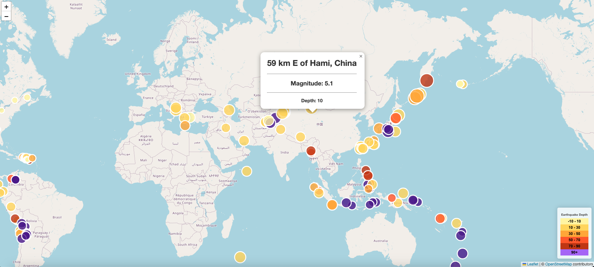

# Leaflet Mapping / Earthquake Data Visualisation

Link to live page: https://amcl11.github.io/earthquake_data_leaflet_visuals/ 

## Overview

Using GeoJSON earthquake data from the United States Geological Survey (USGS) to map and visualise earthquake data from the last 7 days.
The data was sourced on Wednesday 6th September 2023.

The final map visualisation reflects the magnitude of the earthquakes (by marker size), as well as the depth of the earthquake (represented by a darker marker colour). 

## Raw Data
Sourced from [earthquake.usgs.gov](https://earthquake.usgs.gov/earthquakes/feed/v1.0/geojson.php)
Specific 7 day data pulled as of Wed 6th Sept is located at this [LINK](https://earthquake.usgs.gov/earthquakes/feed/v1.0/summary/all_week.geojson)

## References:
Dataset created by the [United States Geological Survey](https://earthquake.usgs.gov/earthquakes/feed/v1.0/geojson.php)
